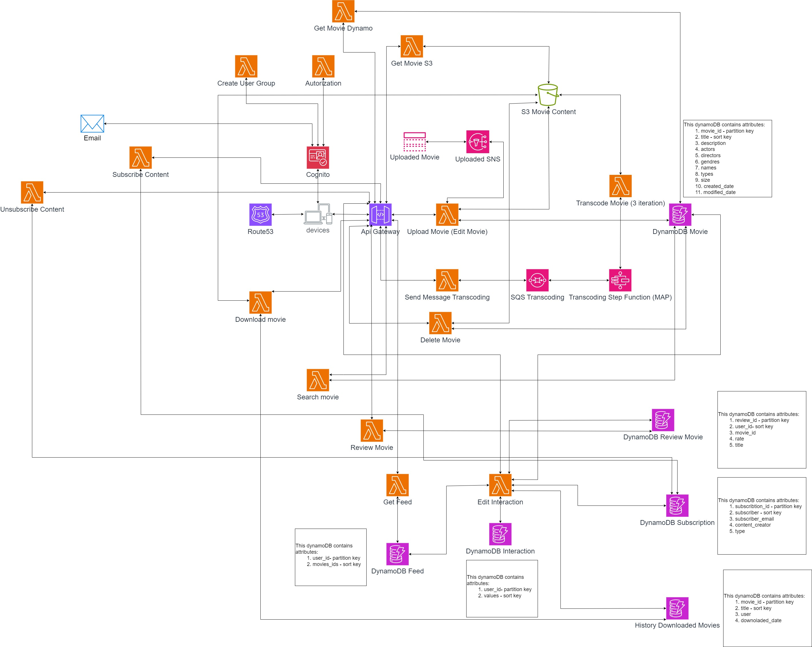

# Description 

This project is a cloud-native web application aimed at storing and managing movie content. The application is built using AWS CDK in Python for the backend and the Angular framework for the frontend.

# Diagram



# Project Components
 - Server Application: A cloud-native solution that implements the full logic, utilizing AWS services.
 - Client Application: Offers a graphical user interface for users to interact with the system's features.

# AWS Services
  - Lambda
  - Simple Storage Service (S3)
  - DynamoDB
  - API Gateway
  - Simple Notification Service
  - Simple Queue Service
  - Step functions

## Installation

1. **Clone the Repository**:
    ```
    git@github.com:popovicluka65/cloud-movies.git
    ```
### Backend
2. **Create Virtual Environment**:
    ```
    python -m venv venv
    ```
3. **Activate Virtual Environment**:
    ```
    venv\Scripts\activate  
    ```
4. **Install Dependencies**:
    ```
    pip install -r requirements.txt
    ```
### Frontend
5. **Install**:
    ```
    npm install 
    ```

## Members
- Luka Popovic
- Matija Popovic
- Luka Farkas


